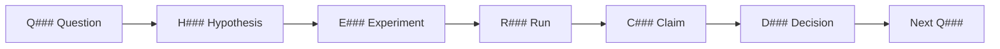

# Evidence Graph

The repo is organized around linked research objects.



## Object Meanings

- `Q###`: an uncertainty that can be answered.
- `H###`: a falsifiable expectation for an experiment.
- `E###`: an experiment card, stable across runs.
- `R###`: one concrete run with command, data, metrics, and artifacts.
- `C###`: a durable belief updated by evidence.
- `D###`: a choice that changes the research path.
- `P###`: a paper, repo, dataset, or outside reference.

## Why This Exists

Chronological logs are good memory. They are bad navigation.

The evidence graph lets a researcher ask:

```text
Which experiments support this claim?
What would change this decision?
Which question should we answer next?
```
